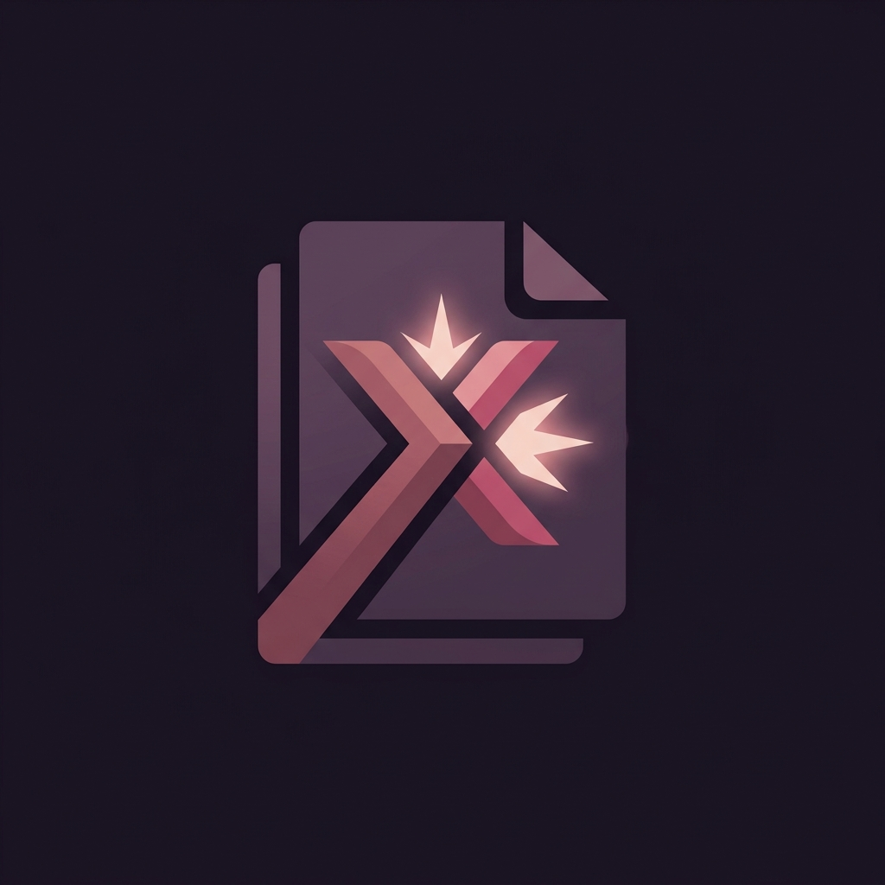

<div align="center">



# NexPDFCoX

### Free PDF Tools Suite — Convert · Merge · Compress

[](https://nexpdfcox.vercel.app)
[](https://reactjs.org)
[](https://typescriptlang.org)
[](https://tailwindcss.com)
[](https://vitejs.dev)
[](LICENSE)

> **100% client-side PDF processing** — your files never leave your browser.  
> No registration. No server. No data collection. Free forever.

</div>

---

## ✨ Features

| Tool | Description |
|------|-------------|
| 📄 **PDF → Image** | Convert PDF pages to JPG, PNG, or WebP at 72/150/300 DPI |
| 🖼️ **Image → PDF** | Merge images into a PDF with custom page size, orientation, and margins |
| 🗜️ **PDF Compressor** | Compress PDFs up to 85% — Light / Medium / High / Maximum levels |

### 🔑 Highlights
- ⚡ **Instant** — Web Workers keep the UI responsive during heavy processing  
- 🔒 **Private** — Zero server uploads; all processing runs in your browser  
- 🌙 **Dark / Light Mode** — Remembers your preference  
- 📦 **Batch Processing** — Convert 50+ images or pages at once  
- 🗂️ **ZIP Download** — Multi-page PDF→Image exports packaged automatically  
- 🎯 **Drag-to-Reorder** — Reorder images before merging into PDF  
- 💰 **AdSense Ready** — 4 configurable ad placements via `.env`  
- 📱 **Responsive** — Mobile · Tablet · Desktop layouts  
- ♿ **Accessible** — WCAG 2.1 AA, keyboard navigation, ARIA labels  

---

## 🖥️ Preview

<div align="center">

| PDF → Image | Image → PDF | PDF Compressor |
|:-----------:|:-----------:|:--------------:|
| Format, DPI & quality selector | Drag-to-reorder image grid | 4 compression levels + stats |

</div>

---

## 🚀 Quick Start

### Prerequisites
- [Node.js](https://nodejs.org) v18+  
- npm v9+

### Installation

```bash
# 1. Clone the repository
git clone https://github.com/sainived2026/NexPDFCoX.git
cd NexPDFCoX

# 2. Install dependencies
npm install

# 3. Set up environment variables
cp .env.example .env
# Edit .env with your real AdSense slot IDs

# 4. Start the development server
npm run dev
```

Open **http://localhost:5173** in your browser.

---

## ⚙️ Configuration (`.env`)

Copy `.env.example` to `.env` and fill in your values:

```env
# Google AdSense Publisher ID
VITE_ADSENSE_PUBLISHER_ID=pub-XXXXXXXXXXXXXXXXX

# Ad Slot IDs (from adsense.google.com → Ads → By ad unit)
VITE_AD_SLOT_HORIZONTAL=YOUR_HORIZONTAL_SLOT_ID   # 728×90  — below header
VITE_AD_SLOT_RECTANGLE=YOUR_RECTANGLE_SLOT_ID     # 300×250 — in-content
VITE_AD_SLOT_VERTICAL=YOUR_VERTICAL_SLOT_ID       # 300×600 — right sidebar
VITE_AD_SLOT_RESPONSIVE=YOUR_RESPONSIVE_SLOT_ID   # Auto    — mobile

# Site URL (for canonical tags)
VITE_SITE_URL=https://nexpdfcox.vercel.app

# Google Analytics 4 (optional)
VITE_GA4_ID=G-XXXXXXXXXX
```

> ⚠️ **Never commit `.env`** — it is git-ignored by default.  
> ✅ **Commit `.env.example`** — it's the safe template for contributors.

---

## 🗂️ Project Structure

```
NexPDFCoX/
├── public/
│   ├── favicon.svg              # SVG brand icon
│   └── logo.png                 # Full logo (PNG)
├── src/
│   ├── components/
│   │   ├── Header.tsx           # Logo + tab navigation + dark mode toggle
│   │   ├── Footer.tsx           # Trust badges + links
│   │   ├── Toast.tsx            # Notification system (context + provider)
│   │   ├── AdUnits.tsx          # Google AdSense (reads from .env)
│   │   ├── Upload/
│   │   │   └── DragDropZone.tsx # Animated drag-and-drop zone
│   │   └── Tools/
│   │       ├── PDFToImage.tsx   # Tool #1 — PDF to image conversion
│   │       ├── ImageToPDF.tsx   # Tool #2 — Image to PDF merger
│   │       └── PDFCompressor.tsx# Tool #3 — PDF compressor
│   ├── hooks/
│   │   ├── useDarkMode.ts       # Dark mode with localStorage
│   │   └── useLocalStorage.ts   # Type-safe localStorage hook
│   ├── utils/
│   │   ├── pdfUtils.ts          # pdfjs-dist rendering + pdf-lib compression
│   │   └── imageUtils.ts        # Canvas image processing + PDF creation
│   ├── types/index.ts           # Full TypeScript type definitions
│   ├── styles/globals.css       # Design system: tokens, components, animations
│   ├── App.tsx                  # Root layout: ads, tools, sidebar
│   └── main.tsx                 # React 18 entry point
├── .env                         # 🔒 Your secrets (git-ignored)
├── .env.example                 # ✅ Safe template for contributors
├── .gitignore
├── index.html                   # SEO + Schema.org + AdSense script
├── tailwind.config.js           # Brand color tokens
├── vite.config.ts               # Code-splitting + optimization
├── vercel.json                  # SPA rewrites + security headers
└── README.md
```

---

## 🎨 Design System

**Aesthetic Direction:** Dark Alchemist / Warm Gothic Premium

| Token | Hex | Role |
|-------|-----|------|
| 🌸 Blush | `#EACDC2` | Text on dark, glow effects |
| 🌹 Rose | `#B75D69` | Primary CTA, active states |
| 🍇 Plum | `#774C60` | Mid-tone gradients |
| 🍆 Eggplant | `#372549` | Deep surfaces |
| 🌑 Void | `#1A1423` | Dark mode background |

**Fonts:** [Space Grotesk](https://fonts.google.com/specimen/Space+Grotesk) (display) · [DM Sans](https://fonts.google.com/specimen/DM+Sans) (body) · [JetBrains Mono](https://fonts.google.com/specimen/JetBrains+Mono) (labels)

---

## 🛠️ Tech Stack

| Layer | Technology |
|-------|-----------|
| Framework | React 18 + TypeScript 5 |
| Styling | Tailwind CSS v3 + custom design system |
| PDF Rendering | [pdfjs-dist](https://github.com/mozilla/pdf.js) |
| PDF Creation | [pdf-lib](https://github.com/Hopding/pdf-lib) |
| File Upload | [react-dropzone](https://github.com/react-dropzone/react-dropzone) |
| ZIP Download | [JSZip](https://github.com/Stuk/jszip) + [FileSaver.js](https://github.com/eligrey/FileSaver.js) |
| Build | [Vite 5](https://vitejs.dev) with code-splitting |
| Deploy | [Vercel](https://vercel.com) (free tier) |

---

## 🚀 Deployment

### Deploy to Vercel (Recommended — Free)

```bash
# Install Vercel CLI
npm i -g vercel

# Deploy
vercel --prod
```

Set your `.env` variables in the **Vercel dashboard** → Project → Settings → Environment Variables.

### Build for Production

```bash
npm run build
# Output in dist/
```

---

## 📋 Available Scripts

| Command | Description |
|---------|-------------|
| `npm run dev` | Start development server at localhost:5173 |
| `npm run build` | Production build → `dist/` |
| `npm run preview` | Preview production build locally |

---

## 🔒 Privacy & Security

- **No server-side processing** — all PDF/image operations run in your browser
- **No file uploads** — files are read locally using File API
- **No cookies** — only `localStorage` for user preferences (dark mode)
- **Security headers** — `X-Frame-Options`, `X-Content-Type-Options`, `Referrer-Policy` via `vercel.json`
- **Asset caching** — immutable cache headers for static assets

---

## 📄 License

MIT © 2026 [sainived2026](https://github.com/sainived2026)

---

<div align="center">

**Made with ❤️ and 🌹 by sainived2026**

[⭐ Star this repo](https://github.com/sainived2026/NexPDFCoX) · [🐛 Report a bug](https://github.com/sainived2026/NexPDFCoX/issues) · [💡 Request a feature](https://github.com/sainived2026/NexPDFCoX/issues)

</div>
